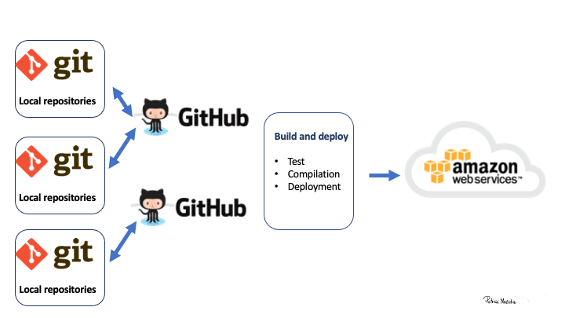

# You are working on a project and it is going great!

```{r out.width = '90%', echo = FALSE, fig.align = "center"}
knitr::include_graphics("photos/markus-spiske-kK7uPfb2YWU-unsplash.jpg")
```

---
# You return to the same project few months later

```{r out.width = '70%', echo = FALSE, fig.align = "center"}

```


Photo by <a href="https://unsplash.com/@maguay?utm_source=unsplash&utm_medium=referral&utm_content=creditCopyText">Matthew Guay</a> on <a href="https://unsplash.com/s/photos/messy-cable?utm_source=unsplash&utm_medium=referral&utm_content=creditCopyText">Unsplash</a>
  
  
---
# Let's unpack: What could possible go wrong??!!

.pull-left[
```{r out.width = '70%', echo = FALSE, fig.align = "center"}

```
]

.pull-right[
```{r out.width = '70%', echo = FALSE, fig.align = "center"}

```
]

.pull-left[
```{r out.width = '70%', echo = FALSE, fig.align = "center"}

```
]
.pull-right[
```{r out.width = '70%', echo = FALSE, fig.align = "center"}

```
]


---
# Live our lives peacefully

```{r out.width = '90%', echo = FALSE, fig.align = "center"}
knitr::include_graphics("css/colton-sturgeon-6KkYYqTEDwQ-unsplash.jpg")
```

---
class: left, top
# Reproducible research and replicability

**Definitions by the USA National Academies of Science, Engineering and Medicine**:

- .green[Reproducibility] ("computational reproducibility") means obtaining consistent computational results using the same input data, computational steps, methods, code, and conditions of analysis. 

- .green[Replicability] means obtaining consistent results across studies aimed at answering the same scientific question, each of which has obtained its own data


  
[Reference here: Report on reproducibility and replicability](https://www.nap.edu/read/25303/chapter/1#xix)


---
class: left, top
# In other words: Reproducibility 

.pull-left[
```{r out.width = '90%', echo = FALSE, fig.align = "center"}
knitr::include_graphics("photos/xavi-cabrera-kn-UmDZQDjM-unsplash.jpg")
```

Photo by <a href="https://unsplash.com/@xavi_cabrera?utm_source=unsplash&utm_medium=referral&utm_content=creditCopyText">Xavi Cabrera</a> on <a href="https://unsplash.com/s/photos/lego?utm_source=unsplash&utm_medium=referral&utm_content=creditCopyText">Unsplash</a>
  
]


.pull-right[

- Pieces (data)
- Instructions/manual (analysis)
- Tools (build environment)

]

<!-- --- -->

<!-- class:  left, top -->

<!-- # Reproducible research -->

<!-- * Working to make your research reproducible does require extra upfront effort. -->

<!-- * Making a project reproducible from the start encourages you to use better -->
<!-- work habits. -->

<!-- * It should push you to bring your data and source code up to a higher -->
<!-- level of quality than you might if you “thought ‘no one was looking’ ” [Donoho, -->
<!-- 2010, 386].  -->

<!-- * Reproducible research needs to be stored so that other researchers can actually access the data and source code.  -->

<!-- * Changes are easier to implement $\rightarrow$ specially when using dynamic reproducible documents. -->

<!-- * Reproducible research has higher impact. -->


---

class:  left, top

# Philosophy 

To make our projects reproducible we need to think at the beginning of any project about ("computational") reproducibility.


* Working to make our projects/research reproducible does require extra upfront effort.

* Requires planning.

* Demands to be organized.

* Need to think more broadly.


---

class:  left, top

# Reproducibility complexity 


Complexity varies if the project requires a single tool and involves only one person as when we deal with team complex projects requiring many different tools.


---
class:  left, top
# Accesible connected  workflow

```{r out.width = '50%', echo = FALSE, fig.align = "center"}
knitr::include_graphics("photos/tamas-tuzes-katai-KJA1xo42dr4-unsplash.jpg")
```

---
class:  transition
# Practical tips

- Plan the type and scale of the project
- Think carefully about how the pieces can be connected
- From day one: documentation data provenance and licensing/ scripts/ tools ...
- Think about your future self and other users
- Work maintenance (team)
- External services / dependencies


---
class:  transition
# Some Practical Steps 


---
class:  transition
# Many different types of projects

- Projects vary in complexity and tools used.

- Projects can have single contributors or many contributors.

- Sometimes our role is only on one small piece of the puzzle.

.pull-left[
- While some other times we are in charge of putting it all together. 
]
.pull-right[
```{r out.width = '50%', echo = FALSE, fig.align = "center"}
knitr::include_graphics("photos/jonny-gios-SqjhKY9877M-unsplash.jpg")
```
]


---
class:  transition
# Project organization 


Think before you start how you are going to organize your project and prepare the scafolding for that.

- For example folder where all the contents of the project will be stored.
- In particular, where is the data going to be stored and how?
- Scripts and codes
- How are other things going to be stored or refer to?
- How different contents are liked together?
- Overall documentation?
- All the elements that another person will need to be able to re-create or reproduce the project.

---
class:  transition
# Project organization: Examples

```{r out.width = '80%', echo = FALSE, fig.align = "center"}
knitr::include_graphics("photos/project1.png")
```


---
class:  transition
# Project organization: Examples II

---
class:  transition
# Project organization: Examples

```{r out.width = '80%', echo = FALSE, fig.align = "center"}

```


---
class:  transition
# Documentation

- Scripts and code documentation
- Make usage of README files
- In more complex projects a writing a journal might be required
- Connect entries to the journal to files or other info 


---
class:  transition
# Data handling 

- Record the provenance and licensing of the data.
- Use raw data (as much as possible).
- Integrate all the data preparation and data wrangling in the project:
     * Scripts of different programming languages
     * Using other software such as excel/SAS/SQL etc. If this is the case, all the steps must be documented so all can be reproduced.


---
class:  left, top
# You will need a toolbox

Using tools for reproducible research and reporting

```{r out.width = '70%', echo = FALSE, fig.align="center"} 
 knitr::include_graphics("figs/how.jpg") 
```
.tiny[<span>Photo by <a href="https://unsplash.com/@toddquackenbush?utm_source=unsplash&amp;utm_medium=referral&amp;utm_content=creditCopyText">Todd Quackenbush</a> on <a href="https://unsplash.com/s/photos/tools?utm_source=unsplash&amp;utm_medium=referral&amp;utm_content=creditCopyText">Unsplash</a></span>]


---
class:  left, middle
# Dynamic documents

.content-box-green[
* Include code use for data analysis + 
                       report text =
                       Report/Paper
]
All in a .green[sequential] and .green[dynamic way]!


---
# Project Files: Order versus mess
.pull-left[

```{r out.width = '80%', echo = FALSE}

```


]

.pull-right[

```{r out.width = '80%', echo = FALSE}
knitr::include_graphics("figs/sharon-mccutcheon-tn57JI3CewI-unsplash.jpg")
```


]


---
class: center, top

# Computer paths

```{r out.width = '80%', echo = FALSE}
knitr::include_graphics("figs/nathan-anderson-uq5JjGK_4SE-unsplash.jpg")
```

Where are files and folders store in our computer?

---
class: left, top
# Computer Paths

* A _path_ is the complete location or name of where a computer 
file, directory, device, or web page is located.

## Examples

  - .bolder[Windows] $\rightarrow$ .purple[C:\documents\ETC5513]
  - .bolder[Mac/linux] $\rightarrow$ .purple[/Users/documents/ETC5513]
  - .bolder[Internet path] $\rightarrow$ .purple[http://www.google.com]
 


---
class: left, top
# Absolute and Relative Paths

* .bold[Absolute or full path]
An absolute or full path begins with a drive letter followed by a colon, such as D: or /users.
  - Windows: C:\documents\charlie
  - Mac/linux: /Users/documents/courses/ETC5513

* .bold[Relative path]
A relative path refers to a location that is .green[relative to a current directory] (or folder):
  - ETC5513/exercise.Rmd
(no matter where the folder sits things can actually run)
.content-box-soft[ 
It is essential to understand where your directories (folder) and files are within your computer. 
Having clarity about that and the projects file architecture
gives you total control about its organization
]


---
class: middle, middle
# What is a version control system?

.content-box-soft[
"Version control is a system that records changes to a file or set of files over time so that you can recall specific versions later."]

.green[It also allow us to collaborate and share our projects with others!]

[Book on Git here - fantastic resource](https://git-scm.com/book/en/v2).

```{r out.width = '30%', echo = FALSE, fig.align = "right"}
knitr::include_graphics("figs/hat.png")
```


---
class: left, middle
# Version control

- .content-box-soft[Version control systems are a category of software tools that 
help store and manage changes to source code (projects) over time.]
- .content-box-soft[Version control software keeps track of every modification
to the source code in a special kind of database.]
- .content-box-soft[If a mistake is made, you can turn back to previous versions 
and compare the code to fix the problem while minimizing disruption.]
- .content-box-soft[It is easy to manage multiple versions of a project
]
- .content-box-soft[It is a very useful (actually essential!) tool for 
collaborating and for sharing open source resources.]


---
class: left, middle
# Different Version control Systems

.bold[.green[Distributed version control systems]]

.pull-left[
```{r out.width = '70%', echo = FALSE}
knitr::include_graphics("figs/distributed.png")
```

[Figure source & more info](https://git-scm.com/book/en/v2/Getting-Started-About-Version-Control)
]
.pull-right[
- These systems --> .green[fully mirror the repository], including its full history in .green[various servers/locations]
- If any server malfunction, and these systems were collaborating via that server, any of the client 
repositories can be copied back up to the server to restore it. 
- Every clone is really a full backup of all the data.
]


---
# Distributed Version Control: Git
.bold[.green[We are going to use a distributed version control called Git]]

```{r out.width = '70%', echo = FALSE}
knitr::include_graphics("figs/Git-Logo-Black.png")
```


---
class: left, middle
# Git for us 
.content-box-soft[ 
      - A system for controlling our project versions
      - A disaster recovery system
      - A synchronization service
      - A platform for disseminating our work
      - A tool for collaboration
      - ...
]
[More on Git here](https://git-scm.com/book/en/v2)


---
class: left, middle
# Git overview in a nutshell
Let's think of the connections between the different versions of an R project as a tree (Git tree).
.pull-left[
- Git tree example.
- White circles represent each version of the project.
- We have what we call .green[master/main] (default branch).
- We have branches that appeared and then .green[merged]
with the master branch.


]
.pull-right[
```{r out.width = '100%', echo = FALSE, angle = 180}
knitr::include_graphics("figs/git_tree1.jpg")
```
]


---
class: left, middle
# We need to learn
.content-box-neutral[
- How Git operates --> shell/command line
- How to connect our R projects to a Git repo
- How to connect our local Git repo to a Git Cloud repository (GitHub).
]


---
class: left, top
# Command Line Interface (cli)

* .content-box-soft[In most cases (non-linux users) use a Graphical User Interface (GUI) to
interact with their programs and operating systems $\rightarrow$ for example Windows, Mac OX]

* .content-box-soft[However, at the beginning of the computing times most people would use the command line interface to interact with their computer]


```{r out.width = '60%', echo = FALSE, angle = 180, fig.align = "center"}
knitr::include_graphics("figs/shell.png")
```


---
class: left, top
# Git and Command Line  

.green[.bold[Learn how to use the shell/command line interface]]

.bold[Why?]
- .purple[We will use the command line interface to interact with Git and with GitHub]

-  .content-box-soft[The shell or command line interface is an interface where the user types  commands.]

- .content-box-soft[This interface allow us to control our computer using commands entered via our keyboard.]

- .content-box-soft[That means that instead of using a graphical user interface (GUI) + our mouse to open and close programs, 
create folders and moving files --> .green[we are going to type commands].]


---
class: left, top
# Command Line Interface 
Also known as the Shell, command line interface (cli) or terminal is 
an interface for .green[.bold[typing]] commands to interact 
directly with a computer's operating system.

```{r out.width = '40%', echo = FALSE, fig.align = "center"}
knitr::include_graphics("figs/shell.png")
```
#### .green[Examples of things that we can do from the shell or terminal:]
- Navigating through folders and files
- Create/delete folders
- Run and install programs (i.e interact with Git)
- And much more :-)!


---
class: left, middle
# Terminal in action

Typically when you open your terminal, it will welcome you with a
prompt that looks like this:


.content-box-soft[ 
.green[
```
patricia@computerid-macbook:~$
```
]
]
or with the new Catalina Mac OX

.content-box-soft[ 
.green[
``` 
patricia@computerid ~ % 
  ```
] 

]
On Windows it will contain the same elements but look like this:
.content-box-soft[ 
.green[
  ```
patricia@computerid-pc MINGW64 ~$
  ```
]
]


```{r out.width = '40%', echo = FALSE, angle = 180, fig.align = "center"}
knitr::include_graphics("figs/shell.png")
```


---
class: left, top
# Terminal in practice
We will start writing commands after .green[~$ or ~%] depending on the terminal version that you are using

```{r out.width = '70%', echo = FALSE, angle = 180, fig.align = "center"}
knitr::include_graphics("figs/shell.png")
```

- .green[The commands that we are going to use are the same regardless the terminal version you have.]


---
class: inverse
# Let's start learning the commands to navigate our computer and to interact with Git via the command line interface

```{r out.width = '60%', echo = FALSE, angle = 180, fig.align = "center"}
knitr::include_graphics("figs/mael-balland-V5hAryReZzo-unsplash.jpg")
```


---
class: left, middle
# What is the path to my current computer location?

- .bold[.purple[pwd]] --> print working directory/present working directory

.content-box-soft[ 
.green[
``` 
patricia@computerid ~ % pwd
```
]


.content-box-soft[ 
```
/Users/patricia/Documents/ETC5513
```
]] 

#### Understanding the output of .bold[.purple[pwd]] command:
.content-box-soft[ 
```
/Users/patricia/ETC5513/GitHub
```
]
- .green[/] --> represents the root directory
- .green[Users] --> is the  Users directory
- .green[patricia] --> refers to my directory or folder within the users directory
- ...


---
class: left, middle
# Contents within the location --> directory

- Listing the contents of the directory or folder where I am:

.bold[.purple[ls]] --> list files inside my directory

.content-box-soft[ 
.green[
``` 
patricia@computerid Documents~ % ls 
```
]
]
.content-box-soft[ 
``` 
Courses Research Teaching file.pdf example.txt
```
]


- .green[Documents] is an argument to the .purple[.bold[ls]] command. 
- .purple[.bold[ls]] $\rightarrow$ gives you a list of all the elements in a directory
- .purple[.bold[ls -a]]  $\rightarrow$ list of .green[all] the files including .green[hidden ones.]

Each Linux command (pwd,ls ...) have lots of options (.green[flags)] that can be added.  

[A reference list of unix commands with options might be found here](https://explainshell.com)


---
# Command Line Basics: Navigating between directories

.bold[.purple[cd]] --> change directory 

- First we need to make sure where we are .bold[.purple[pwd]].  We can also use .bold[.purple[pwd]] to figure how we can get where we want to go!

- The .bold[.purple[cd]] command syntax is very simple --> we just need to specify the directory 
that we want to navigate to
- At any moment of your navigation, you can use the .bold[.purple[pwd]] command
to confirm your current location
- .green[A path that starts with /] is assumed to be absolute. 


---
# cd in practice!

### My current location is 

.green[Documents (relative location  --> Documents/Research/COVID)]: 

- .purple[.bold[cd Research]]  $\rightarrow$ means that we move into .green[Research]
- .purple[.bold[cd COVID]]  $\rightarrow$ means that we move into .green[COVID]
- .purple[.bold[cd .]]  $\rightarrow$ means the current directory .green[COVID]
- .purple[.bold[cd ..]]  $\rightarrow$ means (parent directory) that we move back into .green[Documents]
- The .purple[.bold[~]] symbol is a shorthand for the user’s home directory and we can use it to form paths:
   - If you are in your .green[Downloads] directory (/Users/John/Downloads) typing
   .purple[.bold[cd ~]]  $\rightarrow$ will bring you to your Home directory /Users/John!


---
# More commands practice!

### My current location is 

.green[COVID (inside we have --> Documents/Research/COVID)]: 

- .purple[.bold[..]] is shorthand for .green["the parent of the current working directory".]

- .purple[.bold[cd ..]]  $\rightarrow$ means that we move into .green[Research] (1 directory up). That is from COVID back to Research


- .purple[.bold[mkdir Project1 Project2]] means .green["make two new directories (folders)"called Project1 and Project2.]


---
# More commands practice!

- .purple[.bold[mv]] move files or folders $\rightarrow$ takes two arguments, the first being files or folders to move and the second being the path to move to.
- .purple[.bold[cp]] $\rightarrow$ this command is used to copy files or group of files or directories. When copy files we need to use .purple[.bold[cp -r]] to copy all the directory contents.

- .purple[.bold[rm]]  $\rightarrow$  remove files and folders

- To remove entire folders .purple[.bold[rm -r]] $\rightarrow$ It requires the -r (recursive) flag.

- We can create empty files with .purple[.bold[touch]] example.Rmd


---
class: middle, center
# Cheat sheet for command line 

Excellent summary about the commands that we will be using can be found 
[here](https://ubuntu.com/tutorials/command-line-for-beginners#1-overview)

.green[You don't need to learn all the commands only those that we are going to use!]


---
class: inverse

#Let's get some practice using the terminal

## Demo


---
# Files in a Git repository

.content-box-soft[ 
The states in a Git repository are: the working directory, the staging area and the 
git directory:
]
* The .green[working directory] is the current snapshot that you are working on.
* The .green[staging area] is where modified files are marked in their current 
version ready to be stored in the database $\rightarrow$ index of changes
* The .green[git directory] is the database where the history is stored

.content-box-neutral[In your file system you will see the folder of your project]

.blue[Three state system ~ Git Development Environment]

More info here [Begining Git and Github](https://git-scm.com/)


---
# Components of a Git repository: Visually


```{r out.width = '90%', echo = FALSE, angle = 180}
knitr::include_graphics("figs/threeSS.jpg")
```

---
# Git repo and remote repository

```{r out.width = '90%', echo = FALSE}
knitr::include_graphics("figs/completeGDE.jpg")
```


---
class: left, middle
# GitHub is our remote repository

```{r out.width = '40%', echo = FALSE, fig.align = "center"}
knitr::include_graphics("figs/Gitvs.Github-1a.jpg")
```
.green[

* GitHub is an interface and cloud hosting service built on top of the Git version
control system.
* Git does the version control and GitHub stores the data remotely.
* GitHub makes your projects accessible on a fully feature project website
]
[More info about GitHub here](https://github.com/features)

<!-- Ref: Reproducible Research with R and R studio (XXXX) -->
<!-- ) -->


---
# Git repo and a remote repository

```{r out.width = '90%', echo = FALSE}
knitr::include_graphics("figs/completeGDE.jpg")
```

---
# GitHub is our remote repository

```{r out.width = '100%', echo = FALSE}
knitr::include_graphics("figs/github_repo.png")
```

---
# Collaborative 

```{r out.width = '100%', echo = FALSE}
knitr::include_graphics("figs/sharing.jpg")
```

---
# From GitHub <--> to our computer


.content-box-neutral[
- Create a repository (.green[repo]) on https://www.github.com
- .green[Clone] this GitHub repository into our computer $\rightarrow$ .green[making a ‘local copy’].
- Work on our local copy of the repo
- .green[Stage and Commit] changes to local repository
- .green[Push] those changes into the remote repo in GitHub.
]

Let's look at all these in more detail!

---
# Creating a repo on GitHub
.pull-left[ 
1. Login into GitHub
2. Click the ‘+’ icon on the top right on 
the menu bar and select ‘New Repository’.
]

.pull-right[ 
```{r out.width = '150%', echo = FALSE}
knitr::include_graphics("figs/newrepo1.png")
```
]

.bold[Important:]
- Repo name
- Repo --> public or private
- Make sure it is initialized with .green[REAME.md]: It is important to have a .green[README.md file] for every repository.
GitHub will use this file as the "presentation" of the repository and should briefly describe what the repo is about.


---
# Creating a repo on GitHub
```{r out.width = '90%', echo = FALSE}
knitr::include_graphics("figs/creatingrepo.png")
```

---
# Configuring Git in your Rstudio  project using the terminal


```{r out.width = '90%', echo = FALSE}
knitr::include_graphics("figs/setgit.png")
```


---
# Configuring Git in your Rstudio Cloud project

First of all we need to get your Git configured in Rstudio Cloud (the same follows for your own computer):

- .green[.bold[Open the command line interface/terminal interface (CLI)]] and type:

- .purple[ git config --global user.email] .green["your.email@example.com"]
- .purple[ git config --global user.name]  .green["Your_Firstname Lastname"]

Make sure you use the same email address for this and for setting up your GitHub account.

- To check that everything is set up correctly, .green[.bold[type the following in the CLI]]:
.purple[ git config --global user.email]
   

---
# Configuring Git in your Rstudio Cloud project using the R console


<br>

Alternative you could type the following in your .green[.bold[R console" inside Rstudio Cloud]]: 

.purple[usethis::use_git_config(user.name = "Your Name Surname",
                                user.email = "Your monash email")]

<!-- --- -->
<!-- # Configuring Github II -->
<!-- ## Setting up the SSH key -->
<!-- * Using the SSH protocol, you can connect and authenticate to remote servers -->
<!-- and services. With SSH keys, you can connect to GitHub without supplying -->
<!-- your username or password at each visit. -->

<!-- *When you set up SSH, you'll generate an SSH key and add it to the ssh-agent and then add the key to your GitHub account. Adding the SSH key to the ssh-agent ensures that your SSH key has an extra layer of security through the use of a passphrase -->


<!-- Ref: https://help.github.com/en/github/authenticating-to-github/about-ssh -->

---
# Getting a remote repository

```{r out.width = '60%', echo = FALSE, fig.align = "center"}
knitr::include_graphics("figs/gitclone.jpg")
```
.green[
* Grabs remote repository from a server/cloud (i.e GitHub)
* Creates a new folder (copy of the remote repository) in our computer
]


---
# Clonning a github repo

When you create a repository on GitHub, it exists as a remote repository.
.green[Users can clone your repository to create a local copy on their own computer 
and sync between the two locations.]

```{r out.width = '50%', echo = FALSE, fig.align = "center"}
knitr::include_graphics("figs/sharing.jpg")
```

More detailed info [here](https://help.github.com/en/github/creating-cloning-and-archiving-repositories/cloning-a-repository)


---
# Adding an SHH key into your GitHub

.green[It is very useful to  add an SSH key into your workflow:]

.content-box-soft[ 
- When working with a Git repository you will be required to identify yourself to GitHub using your username and password *each time to do a commit!*. 
- An SSH key is an alternative way to identify yourself that .bold[does not require you to enter you username and password every time].
- .green[SSH keys come in pairs], a .green[public key] that gets shared with services like GitHub, and a .green[private key] that is stored 
only on your computer or in your Rstudio Cloud project. 
- If the keys match, you're granted access!
]  

More info [here](https://docs.github.com/en/authentication/connecting-to-github-with-ssh/adding-a-new-ssh-key-to-your-github-account) and [here](https://help.github.com/en/github/authenticating-to-github/about-ssh)


---
# From GitHub to our computer

```{r out.width = '60%', echo = FALSE, fig.align = "center"}
knitr::include_graphics("figs/github_repo.png")
```

From our shell or command line:
1. Navigate to the computer location where we want to download the GitHub repo.
2. .purple[.bold[git clone]]  .purple[git@github.com:okayama1/Git_demo.git]. 
3. This will create a folder in your computer with the GitHub repository files and folders.


---
# Three Git States

.content-box-soft[ 
.bold[ Git has three main states that your files can reside in: modified, staged, and committed:]
]

.green[
* .bold[Modified] --> you have changed the file but have not committed it to your repository database yet.

* .bold[Staged] --> you have marked a modified file in its current version to go into your next commit snapshot.

* .bold[Committed] --> the data is safely stored in your local database.
]
This leads us to the three main sections of a Git project: the working tree, the staging area, and the Git directory.


---
# Three Git States Visually 

```{r out.width = '100%', echo = FALSE, fig.align = "center"}
knitr::include_graphics("figs/stages_example.png")
```

[Figure source](https://git-scm.com/book/en/v2)


---
# GitHub Workflow: Visual example

.pull-left[
```{r out.width = '90%', echo = FALSE}
knitr::include_graphics("figs/gitclone.jpg")
```
clone info --> GitHub repo
]

.pull-right[
```{r out.width = '90%', echo = FALSE}
knitr::include_graphics("figs/commit_push.jpg")
```
Working in your computer and updating remote repo in GitHub
]


---
# Tracked and untracked files

* In a git repository tracked files are those which are part of the git repository
* However, we can also have untracked files for which their history is not tracked

.content-box-soft[ 
- Tracked files are files that were in the last snapshot; they can be unmodified, modified, or staged. 
In short, tracked files are files that Git knows about. 
- Untracked files are everything else — any files in your working directory that were
not in your last snapshot and are not in your staging area.
]


More info [here.](https://git-scm.com/book/en/v2/Git-Basics-Recording-Changes-to-the-Repository)

  
---
# From git clone to first commit

* .purple[git clone ".green[remote repo address]"]  $\rightarrow$ is a Git command used to target an existing repository and create a clone (or copy) of the target repository. 
* .purple[git add .green[filename]] $\rightarrow$ it adds a change in the working directory to the staging area. 
* .purple[git commit -m ".green[Message]"] The git commit command captures a snapshot of the project's currently staged changes. (m = message for commit. The git commit is used to create a snapshot of the staged changes along a timeline of a Git projects history.)
* .purple[git push origin .green[master (or main)]]   $\rightarrow$  The git push command is used to upload local repository content to a remote repository, in this case to the master (or main) branch.
  

---
class: left, top
# General Workflow (via Terminal)
 
   -  .purple[git clone] is used to target an existing repository and create a clone, or copy of the target repository.
   -  .purple[git pull]    is used to fetch and download content from a remote repository and immediately update the local repository to match that content.
   -  .purple[git status]  displays the state of the working directory and the staging area
   -  .purple[git add file_name]  adds a change in the working directory to the staging area
   -  .purple[git commit -m "Message"] (m = message for commit. The git commit is used to create a snapshot of the staged changes along a timeline of a Git projects history.)
   -  .purple[git push origin branch name] is used to upload local repository content to a remote repository. 
  
  

---
class: center, middle
# Rstudio  and GitHub


.content-box-neutral[The status/staging panel in Rstudio]


```{r out.width = '90%', echo = FALSE}
knitr::include_graphics("figs/staggingarea.png")
```


---
class: left,top
# Rstudio  and GitHub

.content-box-soft[ 
RStudio keeps Git constantly scanning the project directory to find any files that have changed or which are new.]
- .green[By clicking a file's little "check-box" you can stage it.] 


```{r out.width = '70%', echo = FALSE, fig.align = "center"}
knitr::include_graphics("figs/staggingarea.png")
```


---
class: left,top
# Rstudio  and GitHub

.content-box-green[
.bold[Understanding the symbols in the Rstudio Git pane]:
]
- .blue[.bold[Blue-M]]: a file that is already under version control that has been modified.
- .orange[.bold[Orange-?]]: a file that is not under version control (yet...)
- .green[.bold[Green-A]]: a file that was not under version control, but which has been staged to be 
    committed.
- .red[.bold[Red-D]]: a file under version control has been deleted.  To make it really disappear, you have 
    to stage its disappearance and commit.
- .purple[.bold[Purple-R]]: a file that was renamed.  (Note that git in Rstudio seems to be
    figuring this out on its own.)


---
class: left, top
# Configuration

.content-box-green[    
The .bold[Diff] window
]

- Shows what has changed between the last committed version of a file and its
current state.

- Note: all this output is available from the command line too, but
the Rstudio interface is very nice!

```{r out.width = '60%', echo = FALSE, fig.align = "center"}
knitr::include_graphics("figs/diff.png")
```


---
class: left, top
# Making a Commit
 
- Super easy:
    - After staging the files you want to commit...
    - Write a brief message (first line short, then as much after that as you want)
    and hit the commit button.
    
```{r out.width = '80%', echo = FALSE, fig.align = TRUE}
knitr::include_graphics("figs/commit.png")
```
 
---
class: left, top
# The History window
   
Allow us to understand past commits.

- Easy inspection past commits.
- See what changes were made at each commit.

```{r out.width = '60%', echo = FALSE, fig.align = "center"}
knitr::include_graphics("figs/history.png")
```


---
class: left, top
# Important:

.content-box-green[
- We can interact between Git, GitHub and our local repository using the terminal only
- We can interact between Git, GitHub and our local repository using Rstudio
] 

---
class: left, top
# Branching


.green[Each repository has one default branch, and can have multiple other branches. Branching is a great feature of version control!].

.pull-left[
- It allows you to duplicate your existing repository
- Use a branch to isolate development work without affecting other branches in the repository
- Modification in a branch can be merged into your project.

]
.pull-right[
```{r out.width = '100%', echo = FALSE, angle = 180}
knitr::include_graphics("figs/git_tree.jpg")
```
]

.green[Branching is particularly important with Git as it is the mechanism that is used when you are collaborating with other researchers/data scientists.]


---
class: left, top
# HEAD

.green[HEAD] is a pointer that Git uses to reference the current snapshop that we are looking at.
<br>

```{r out.width = '80%', echo = FALSE, angle = 180}
knitr::include_graphics("figs/gitsnapshots1.png")
```


---
class: left, top
```{r out.width = '100%', echo = FALSE, angle = 180}
knitr::include_graphics("figs/Octocat.png")
```

---
class: left, top
# Creating branches from GitHub

- Create branches directly on GitHub. More info [here](https://help.github.com/en/github/collaborating-with-issues-and-pull-requests/creating-and-deleting-branches-within-your-repository)

```{r out.width = '60%', echo = FALSE, angle = 180}
knitr::include_graphics("figs/GitHub_newbranch.png")
```


---
class: left, top
# Deleting branches from GitHub

.green[Branches]

```{r out.width = '90%', echo = FALSE, angle = 180}
knitr::include_graphics("figs/branch_location.png")
```

---
class: left, top
# Deleting branches from GitHub

```{r out.width = '90%', echo = FALSE, angle = 180}
knitr::include_graphics("figs/delete-branch.png")
```

---
class: left, middle
```{r out.width = '80%', echo = FALSE, angle = 180}
knitr::include_graphics("figs/shell.png")
```

.green[For the time,we will be using the Terminal within Rstudio. However, I personally prefer to use the external terminal.]

---
class: left, top
# Create branches using the Terminal/Shell/CLI
### Using .purple[git branc]h and .purple[git checkout] commands

.content-box-neutral[
- .purple[git branch] --> shows us the branches we have in our repo and marks our current branch with .purple[*]
- .purple[git branch] .green[newbranch_name] --> creates a new branch but does not move the .green[HEAD] of the repo there.
- .purple[git checkout] .green[newbranch_name] --> moves the .green[HEAD] to .green[newbranch_name]
]


---
class: left, top
# Git HEAD and checkout

.bold[How does Git know what branch you’re currently on?]
.content-box-neutral[
 By using the pointer --> HEAD. In Git, this is a pointer to the local branch you are currently on. 
]
Internally, the .purple[git checkout] command  updates the .green[HEAD] to point to either the specified branch or commit. 

---
class: left, top
# Updating those new branches in the remote repo in GitHub
.content-box-neutral[
- We can just update the empty branch into GitHub by <br>
.purple[git push origin newbranch_name]
]

### Alernatively if we had files or changes added into that branch:
- .purple[git add .]  (-->  adding all the modified files into the staging area)
- .purple[git commit -m] .green["Updating new newbranch_name"]
- .purple[git push origin newbranch_name]
 
 
 
---
# Merging branches

.content-box-green[ Switch to the branch that you want to add 
the stuff into (let's say that is master). Then
]

- Merge changes into .green[master] --> .purple[git checkout master]
- Anytime we can use .purple[git status] --> to check the status of our repo
- .purple[git merge newbranch_name -m] .green[“Merging branches”] 
- .purple[git push origin master] updating the remote repository too

```{r out.width = '50%', echo = FALSE}
knitr::include_graphics("figs/branches.png")
```

---
class: left, top
# Deleting branches using cli
.green[Deleting branches from your .bold[local] repository]

- .purple[git branch -a] $\rightarrow$ list all the branches
-  Move to .green[master] [.purple[git checkout master]]
-  Delete unwanted branch .purple[git branch -d Name_of_branch] $\rightarrow$ delete branch called Name_of_branch

.content-box-green[
You cannot delete a branch if your HEAD is on that branch
]

```{r out.width = '30%', echo = FALSE, angle = 180}
knitr::include_graphics("figs/GDE.png")
```


---
class: left, top
# Deleting branches using cli
.green[Deleting branches from your .bold[remote repository] (GitHub)]

1. .purple[git push origin --delete Name_of_branch]

```{r out.width = '80%', echo = FALSE, angle = 180}
knitr::include_graphics("figs/sharing.jpg")
```


---
class: left, top
# How to go back to your previous branch?

- .purple[git checkout branchname]

- Imagine that you have two branches:
   - Master
   - Alternative_analysis
   
- To check in which branch you are currently --> <br>
.purple[git branch] --> .green[Alternative_analysis]  

- To go back to Master (assuming that you were in there) .purple[git checkout master]


---
class: left, top
# Merging branches sucessfully
Suppose we have two branches: .green[master] and .green[new_development]

1. For merging --> go to .green[master] branch .purple[git checkout master]
2. .purple[git merge new_development]
3. This will incorporate the changes made in the branch new_development into master.

.content-box-neutral[
If those steps are successful  your .green[new_development] branch will be fully integrated within the master branch.
]

---
class: left, top
# Merging branches with conflicts
However, it is possible that  Git will not be able to automatically resolve some .green[conflicts], 

.content-box-grey[
````
# Auto-merging index.html
# CONFLICT (content): Merge conflict in index.html
# Automatic merge failed; fix conflicts and then commit the result.
```
]

.green[Important: .bold[DO NOT PANIC]]

---
class: left, top
# You will need to resolve the conflicts
<br>
.content-box-green[
- You will have to resolve them .bold[manually]. 
- This normally happens when two branches the same file but with two different versions. In that case Git is not able to figure out which version to use.
]


---
class: left, top
# Resolving merging conflicts

- First thing to do --> .green[figure out which files are those affected by the conflict]
- .purple[git status]

.content-box-grey[
````
git status
# On branch master
# You have unmerged paths.
#   (fix conflicts and run "git commit")
# 
# Unmerged paths:
#   (use "git add <file>..." to mark resolution)
# 
#     both modified:      example.Rmd
# 
# no changes added to commit (use "git add" and/or "git commit -a")
```
]

---
class: left, top
# Resolving the conflict

- Open the file with a text editor
- Go to the lines which are marked with
.red[

<<<<<<, ====== ,  and >>>>>>

]

- Edit the file
- .purple[git add] filename
- .purple[git commit -m "Message"]
- .purple[git push origin master]

---
class: left, top
# Resolving conflicts
When you open the conflict file in a .bold[text editor such as Rstudio Cloud / Rstudio], you will see the conflicted part marked like this:

.content-box-grey[
````
/* code unaffected by conflict */
<<<<<<< HEAD
/* code from master that caused conflict */
=======
/* code from feature that caused conflict */
```
]

.green[When Git encounters a conflict, it adds .red[<<<<<<<] and .red[======= ] to highlight the parts that caused the conflict and need to be resolved.]


---
class: left, top
# Resolving conflicts in practice

- Open the file in a text editor (for example Rstudio / Rstudio Cloud)
- Decide which part of the code you need to keep in the final .green[master branch]
- .green[Removed the irrelevant code and the conflict indicators]
- Run .purple[git add ] to stage the file/s and .purple[git commit] to commit the changes --> this will generate the merge commit.

---
class: left, top
# Resolving the conflict

```{r out.width = '100%', echo = FALSE, fig.align = "center"}
knitr::include_graphics("figs/conflict.png")
```


---
class: left, top
# Creating branches from Rstudio

```{r out.width = '100%', echo = FALSE, fig.align = "center"}
knitr::include_graphics("figs/Rstudiobranch.png")
```
<br><br>
Important: When we create a branch using Rstudio the branch is created both in 
the local and in the remote repository (at the same time.)
---
class: left, top
# Keep refreshing Rstudio cloud


Otherwise some of your branches and changes might not be updated.

```{r out.width = '100%', echo = FALSE, fig.align = "center"}
knitr::include_graphics("figs/refresh.png")
```


---
class: left, top
# Diff window in Rstudio 

```{r out.width = '100%', echo = FALSE, fig.align = "center"}
knitr::include_graphics("figs/diffwindow.png")
```


---
# Few things to get that are worth
<br><br>

Please follow the link below and get the GitHub Education  pack. Then you can use:

- Atom ([Install Atom from this link](https://atom.io/)) and 
- Gitkraken (from the GitHub education pack for students)

<br>
https://education.github.com/students


---
class: left, middle
# Three important topics

<br>

- GitHub issues --> Great for collaboration. Please see read more [here.](https://docs.github.com/en/issues/tracking-your-work-with-issues/about-issues)

- Licenses --> [Choose the right License](https://choosealicense.com/)

- .gitignore --> See more [here](https://github.com/github/gitignore)


---
class: left, top
# Demo
```{r out.width = '100%', echo = FALSE, fig.align = "center"}
knitr::include_graphics("figs/paul-skorupskas-7KLa-xLbSXA-unsplash.jpg")
```

---

```{r endslide, child="endslide.Rmd"}
```