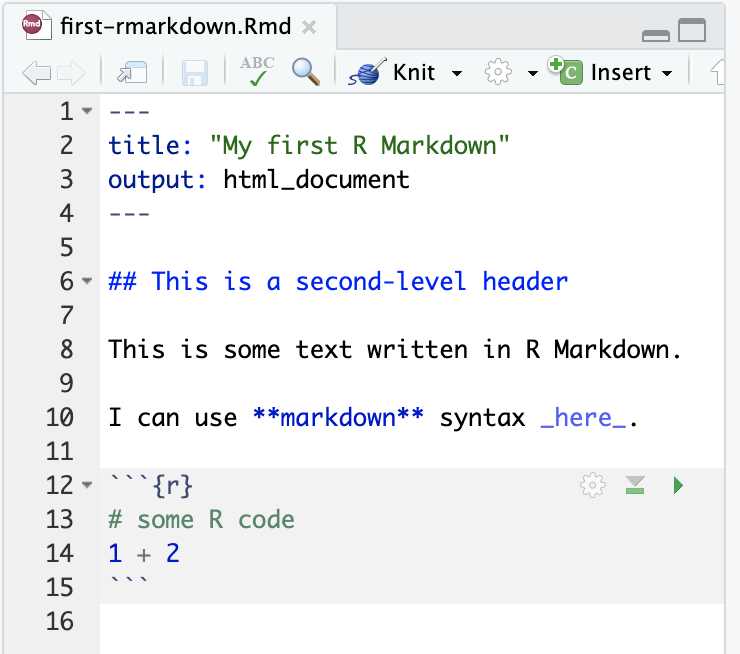
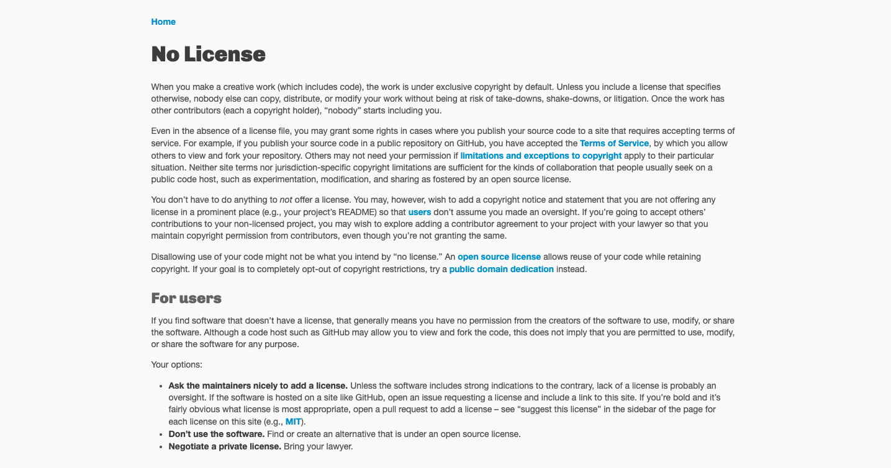

```{r titleslide, child="components/titleslide.Rmd"}
```


```{r setup, include=FALSE}
library(tidyverse)
library(knitr)
library(rmarkdown)
library(kableExtra)
# opts_chunk$set(echo = FALSE,   
#                message = FALSE,
#                warning = FALSE,
#                collapse = TRUE,
#                fig.height = 4,
#                fig.width = 8,
#                fig.align = "center",
#                cache = FALSE)
# options(htmltools.dir.version = FALSE)
```


---
# You are working on a project and it is going great!

<br>
```{r out.width = '80%', echo = FALSE, fig.align = "center"}
knitr::include_graphics("https://media.giphy.com/media/26tOZ42Mg6pbTUPHW/giphy.gif")
```

---
# You return to the same project few months later
<br> <br>
```{r out.width = '60%', echo = FALSE, fig.align = "center"}

```
<br>

.small[Photo by <a href="https://unsplash.com/@maguay?utm_source=unsplash&utm_medium=referral&utm_content=creditCopyText">Matthew Guay</a> on <a href="https://unsplash.com/s/photos/messy-cable?utm_source=unsplash&utm_medium=referral&utm_content=creditCopyText">Unsplash</a>]

---
class:  transition, center
# Critical issue
<br><br>


<br>

.small[https://media.giphy.com/media/11fDMHAzihB8D6/giphy.gif]

  
---
#  What could possible go wrong??!!
<br>
.pull-left[

```{r out.width = '50%', echo = FALSE, fig.align = "center"}

```

]

--
.pull-right[
Which data file was the last one?
```{r out.width = '40%', echo = FALSE, fig.align = "center"}

```

]

--
<br>
.pull-left[

Got a new computer?

```{r out.width = '60%', echo = FALSE, fig.align = "center"}
knitr::include_graphics("figs/helloquence-5fNmWej4tAA-unsplash.jpg")
```
.small[Photo by <a href="https://unsplash.com/@homajob?utm_source=unsplash&utm_medium=referral&utm_content=creditCopyText">Scott Graham</a> on <a href="https://unsplash.com/?utm_source=unsplash&utm_medium=referral&utm_content=creditCopyText">Unsplash</a>
  ]
]

--
<br>
.pull-right[
Copy & paste in the wrong place?

```{r out.width = '60%', echo = FALSE, fig.align = "center"}
knitr::include_graphics("https://media.giphy.com/media/l0HlQXlQ3nHyLMvte/giphy.gif")
```

.small[https://media.giphy.com/media/l0HlQXlQ3nHyLMvte/giphy.gif]
]


---
# Live our lives peacefully

```{r out.width = '80%', echo = FALSE, fig.align = "center"}
knitr::include_graphics("photos/colton-sturgeon-6KkYYqTEDwQ-unsplash.jpg")
```
.small[Photo by <a href="https://unsplash.com/@coltonsturgeon?utm_source=unsplash&utm_medium=referral&utm_content=creditCopyText">Colton Sturgeon</a> on <a href="https://unsplash.com/?utm_source=unsplash&utm_medium=referral&utm_content=creditCopyText">Unsplash</a>
  ]
---
class: left, top
# Reproducible research and replicability

<br><br>
**Definitions by the USA National Academies of Science, Engineering and Medicine**:

<br>
- .green[**Reproducibility**] ("computational reproducibility") means obtaining consistent computational results using the same input data, computational steps, methods, code, and conditions of analysis. 

- .green[**Replicability**] means obtaining consistent results across studies aimed at answering the same scientific question, each of which has obtained its own data.

<br>
  
[Report on reproducibility and replicability](https://www.nap.edu/read/25303/chapter/1#xix)


---
class: left, top
# ~~Figure it out~~

<br><br>
.pull-left[
```{r out.width = '50%', echo = FALSE, fig.align = "center"}

```

```{r out.width = '50%', echo = FALSE, fig.align = "center"}
knitr::include_graphics("figs/karla-hernandez-LrlyZzX6Sws-unsplash.jpg")
```

  
]

<br><br>
.pull-right[

- **Pieces** 
- **Instructions/manual** 
- **Tools** 

<br><br>


.small[Photo by <a href="https://unsplash.com/@xavi_cabrera?utm_source=unsplash&utm_medium=referral&utm_content=creditCopyText">Xavi Cabrera</a> on <a href="https://unsplash.com/s/photos/lego?utm_source=unsplash&utm_medium=referral&utm_content=creditCopyText">Unsplash</a>]

.small[Photo by <a href="https://unsplash.com/@karlahrnndz?utm_source=unsplash&utm_medium=referral&utm_content=creditCopyText">Karla Hernandez</a> on <a href="https://unsplash.com/?utm_source=unsplash&utm_medium=referral&utm_content=creditCopyText">Unsplash</a>
  ]
]

<!-- --- -->

<!-- class:  left, top -->

<!-- # Reproducible research -->

<!-- * Working to make your research reproducible does require extra upfront effort. -->

<!-- * Making a project reproducible from the start encourages you to use better -->
<!-- work habits. -->

<!-- * It should push you to bring your data and source code up to a higher -->
<!-- level of quality than you might if you “thought ‘no one was looking’ ” [Donoho, -->
<!-- 2010, 386].  -->

<!-- * Reproducible research needs to be stored so that other researchers can actually access the data and source code.  -->

<!-- * Changes are easier to implement $\rightarrow$ specially when using dynamic reproducible documents. -->

<!-- * Reproducible research has higher impact. -->


---

class:  left, top

# Philosophy 

<br><br>


Reproducibility is a way of thinking and approach projects:

<br>

.pull-right[
```{r out.width = '50%', echo = FALSE, fig.align = "center"}
knitr::include_graphics("photos/diego-ph-fIq0tET6llw-unsplash.jpg")
```

]

.pull-left[
.content-box-neutral[
* Requires planning.

* Needs extra upfront effort.


* Demands us to be organized.

* Challenges us to think more broadly.
]
]

<br>
.small[Photo by <a href="https://unsplash.com/@jdiegoph?utm_source=unsplash&utm_medium=referral&utm_content=creditCopyText">Diego PH</a> on <a href="https://unsplash.com/?utm_source=unsplash&utm_medium=referral&utm_content=creditCopyText">Unsplash</a>]
---

class:  left, top

# Reproducibility complexity

<br><br>


Complexity varies:

.pull-right[
```{r out.width = '30%', echo = FALSE, fig.align = "center"}

```
]

<br>

.content-box-soft[
-  Some projects require a single tool (R or Phython for example) and involve only one person.
]


.content-box-soft[
-  Other projects might involve different teams and require many different tools.
]


---
# Project example
<br>

```{r out.width = '85%', echo = FALSE, fig.align = "center"}
knitr::include_graphics("figs/environmental-data-science-r4ds-general.png")
```

 .small["Artwork by @allison_horst".]

---
class: center, middle
# Example: R, Rstudio and Rmarkdown files

<br>
.pull-left[
```{r out.width = '90%', echo = FALSE}

```
]

<br>
.pull-right[
```{r out.width = '90%', echo = FALSE}

```
]


---
# Literate programming

<br><br>
.content-box-neutral[
Literate programming is an approach to writing reports using software that weaves together the source code and text at the time of creation. 
]

<br>

.blue[Donald Knuth coined the term
literate programming in the 1970s to refer to a source file
that could be both run by a computer and “woven” with a
formatted presentation document [Knuth, 1992].]


---
# Complex workflow example

```{r out.width = '100%', echo = FALSE, fig.align = "center"}

```


.pull-left[
```{r out.width = '150%', echo = FALSE, fig.align = "center"}

```
]
.pull-right[
```{r out.width = '70%', echo = FALSE, fig.align = "center"}

```
]

<br>
.small[https://www.ereefs.org.au/about/]
---
# Complex projects need more than literate programming

```{r out.width = '80%', echo = FALSE, fig.align = "center"}
knitr::include_graphics("photos/umberto-FewHpO4VC9Y-unsplash.jpg")
```
.small[Photo by <a href="https://unsplash.com/@umby?utm_source=unsplash&utm_medium=referral&utm_content=creditCopyText">Umberto</a> on <a href="https://unsplash.com/@umby?utm_source=unsplash&utm_medium=referral&utm_content=creditCopyText">Unsplash</a>
  ]

<br><br>
Literate programming


---
class: transition

<br><br>

#Reproducibility set up will depend on the project

<br><br>
General practical tips for reproducible workflows

<br>
.orange[There is no one-size-fits-all approach!]


---
class: transition
# Tip 1: Plan in adavance

<br>

- Plan the type and scale of the project for reproducibility (as much as possible!).
- Brainstorm about how  different components are to be connected in a reproducible way. Update when necessary.
- .purple[.bold[Think about your "future self" and others.]]
- Set up a version control system.
- Plan for literate programming and scripting as much as possible.
- Keep revising and updating the plans as you go.

---
# Workflow organization 


Decide how you are going to organize your project's workflow and prepare the scaffolding for that.

<br>

- For example, think about the project folder's structure
- In particular, where is the data going to be stored and how?
- Where will you place the scripts and codes? 
- How are other things going to be stored in the project?
- How are the different elements going to be linked together?
- Where will you place the project documentation?

<br>
.content-box-soft[
 .blue[Think about someone else that have no clue about this project and will need to run it in 3 years time!] 
]


---
class:  middle, top

# What is a version control system?

```{r out.width = '40%', echo = FALSE, fig.align= "center"}
knitr::include_graphics("figs/marco-lermer-bHZ2_D4bTfg-unsplash.jpg")

```
<br>

.content-box-soft[.bold[.green[Version control is a system that records changes to a file or set of files over time
so that you can recall specific versions later.]]]

<br>
.green[It also allows us to collaborate and share our projects with others!]


.small[<span>Photo by <a href="https://unsplash.com/@malepics?utm_source=unsplash&amp;utm_medium=referral&amp;utm_content=creditCopyText">Marco Lermer</a> on <a href="https://unsplash.com/?utm_source=unsplash&amp;utm_medium=referral&amp;utm_content=creditCopyText">Unsplash</a></span>]


---
class: left, middle
# Version control

<br>
- .content-box-soft[Version control systems are a category of software tools that 
help store and manage changes to source code (projects) over time.]
- .content-box-soft[Version control software keeps track of every modification
to the source code in a special kind of database.]
- .content-box-soft[If a mistake is made, you can turn back to previous versions 
and compare the code to fix the problem while minimizing disruption.]
- .content-box-soft[It is easy to manage multiple versions of a project
]
- .content-box-soft[It is a very useful (actually essential!) tool for 
collaborating and for sharing open source resources.]


---
class:  left, top

# Git
<br>
.pull-left[
```{r out.width = '70%', echo = FALSE}
knitr::include_graphics("figs/Git-Logo-Black.png")
```
]

.pull-right[
```{r out.width = '70%', echo = FALSE}
knitr::include_graphics("figs/git_tree2.jpg")
```
<br>
]


<br><br>


"Git is a distributed version-control system for tracking changes in source 
code during software development. It is designed for coordinating work among 
programmers, but it can be used to track changes in any set of files. Its 
goals include speed, data integrity,  and support for distributed, non-linear workflows"

.small[https://en.wikipedia.org/wiki/Git]

---
class:  left, top
#Github, Bitbucket and others

<br>
.pull-left[
```{r out.width = '80%', echo = FALSE}
knitr::include_graphics("figs/atlassian_Bitbucket_Logo.png")
```
]

.pull-right[
```{r out.width = '70%', echo = FALSE}
knitr::include_graphics("figs/GitHub_Logo.png")
```
]

<br>

* Both are cloud-based hosting service that lets you manage Git repositories.

* .green[GitHub/Bitbucket] are code hosting platform for version control and collaboration. It lets you and others work together on projects from anywhere.


---
class:  center, top
# Git and Github

<br>
```{r out.width = '60%', echo = FALSE}

```

.small[Source: https://blog.devmountain.com/git-vs-github-whats-the-difference/]

---
# Sharing: team work / open source
<br>
```{r out.width = '90%', echo = FALSE, fig.align = "center"}
knitr::include_graphics("figs/sharing.jpg")
```


---
class: transition
# Tip 2: File system for the project
<br><br>

- Organize project files for reproducibility.
- Think carefully about files accessibility.
- Consider the different types of files in the project.
- Prepare for storage requirements.
- Think about the connectivity between the different components.

.pull-right[
```{r out.width = '40%', echo = FALSE, fig.align = "center"}
knitr::include_graphics("photos/hiclipart2.png") 
```
]

---
class: center, top

# Computer Paths
<br>

```{r out.width = '60%', echo = FALSE}
knitr::include_graphics("figs/nathan-anderson-uq5JjGK_4SE-unsplash.jpg")
```

Where are files and folders stored in our computer?

<br>
.small[Photo by <a href="https://unsplash.com/es/@nathananderson?utm_source=unsplash&utm_medium=referral&utm_content=creditCopyText">Nathan Anderson</a> on <a href="https://unsplash.com/?utm_source=unsplash&utm_medium=referral&utm_content=creditCopyText">Unsplash</a>
  ]

---
class: left, top
# Computer Paths

<br><br>

* A .purple[_path_ is] the complete location or name of where a computer 
file, directory, device, or web page is located.

## Examples

  - .bolder[Windows] $\rightarrow$ .purple[C:\documents\example]
  - .bolder[Mac/linux] $\rightarrow$ .purple[/Users/documents/example]
  


---
class: left, top
# Absolute and Relative Paths

<br>

* .green[**An absolute or full path**] contains the computer root's directory and all other sub directories where a file is located.

  .purple["C:\documents\example\file.txt"]


<br>

* .green[**Relative path**]  refers to a location that is .green[relative to a current directory] (or folder).

   .purple["example\file.txt"]
  
<br>  
.content-box-neutral[ 
A reproducible project should not have absolute paths!
]

---
# Neat File System
<br>

.pull-left[

```{r out.width = '67%', echo = FALSE}
knitr::include_graphics("figs/omid-kashmari-s34f0Wxbens-unsplash.jpg")
```

.small[Photo by <a href="https://unsplash.com/@omidkashmari?utm_source=unsplash&utm_medium=referral&utm_content=creditCopyText">Omid Kashmari</a> on <a href="https://unsplash.com/@omidkashmari?utm_source=unsplash&utm_medium=referral&utm_content=creditCopyText">Unsplash</a>
  ]
]


.pull-right[

```{r out.width = '60%', echo = FALSE}
knitr::include_graphics("figs/sharon-mccutcheon-tn57JI3CewI-unsplash.jpg")
```
.small[Photo by <a href="https://unsplash.com/@sharonmccutcheon?utm_source=unsplash&utm_medium=referral&utm_content=creditCopyText">Alexander Grey</a> on <a href="https://unsplash.com/?utm_source=unsplash&utm_medium=referral&utm_content=creditCopyText">Unsplash</a>
  ]
]


---
class:  transition
# Project organization: Examples

```{r out.width = '80%', echo = FALSE, fig.align = "center"}

```

---
class:  transition
# Project organization: Examples

```{r out.width = '80%', echo = FALSE, fig.align = "center"}
knitr::include_graphics("photos/project.png")
```


---
class: transition
# Tip 3: Accessible connected  workflow

```{r out.width = '40%', echo = FALSE, fig.align = "center"}
knitr::include_graphics("photos/tamas-tuzes-katai-KJA1xo42dr4-unsplash.jpg")
```
.small[Photo by <a href="https://unsplash.com/@tamas_tuzeskatai?utm_source=unsplash&utm_medium=referral&utm_content=creditCopyText">Tamas Tuzes-Katai</a> on <a href="https://unsplash.com/@tamas_tuzeskatai?utm_source=unsplash&utm_medium=referral&utm_content=creditCopyText">Unsplash</a>
  ]

---
# Data handling 

<br><br>


- Record the **provenance** and licensing of the data.
- Use raw data and keep data files as **read-only** whenever possible.
- Integrate all the data preparation and data wrangling in the project to ensure reproducibility:

<br>
.content-box-soft[
     * In some projects data wrangling might be done using different software.
     * When different software is used (SQL/SAS/Excel/Python)  all the steps and how they connect must be documented.
]


---
class: transition
# Tip 4: Documentation

<br>

- Document for reproducibility from day 0.
- Describe all the elements of the project. 
- Keep a journal for manual steps.
- Be specific about documenting how different components are linked together to ensured reproducibility.
- Data provenance, licensing, scripts,  any tools used in the project.
- Clean up when necessary!

.pull-right[
```{r out.width = '30%', echo = FALSE, fig.align = "center"}
knitr::include_graphics("photos/hiclipart2.png") 
```
]

<br>

.orange[Think about your  future self and  others that might need to use the project.]


---
# README   example
<br>
README example from [UNCTAD](https://github.com/dhopp1-UNCTAD/nowcast_data_update): 
**United Nations Conference on Trade and Development**.

```{r out.width = '60%', echo = FALSE, fig.align = "center"}

```

.small[https://github.com/dhopp1-UNCTAD/nowcast_data_update]


---
# README complex example
<br>
 **AIMS eReefs Visualisations and aggregations platform documentation repository.**

```{r out.width = '50%', echo = FALSE, fig.align = "center"}

```

.small[https://github.com/open-AIMS/ereefs-documentation]


<!-- --- -->
<!-- class:  transition -->
<!-- # Practical tips -->

<!-- - Plan the type and scale of the project -->
<!-- - Think carefully about how the pieces can be connected -->
<!-- - From day one: documentation data provenance and licensing/ scripts/ tools ... -->
<!-- - Think about your future self and other users -->
<!-- - Work maintenance (team) -->
<!-- - External services / dependencies -->


---
class: transition
# Tip 5: Code Environment Container

<br>
**Have you ever encountered the following issue?**

<br>

- My code run 6 months ago (.green[I am sure!]) and now it is not working.
- My figures in ggplot look funny ...
- Mostly it is all about your program versions!!

<br>
.pull-right[
```{r out.width = '35%', echo = FALSE, fig.align = "center"}
 
```
]


.small[Photo by <a href="https://unsplash.com/@markusspiske?utm_source=unsplash&utm_medium=referral&utm_content=creditCopyText">Markus Spiske</a> on <a href="https://unsplash.com/@markusspiske?utm_source=unsplash&utm_medium=referral&utm_content=creditCopyText">Unsplash</a>]

---
# Light weight dependency management
<br>

.content-box-neutral[
 There are a couple of R dependency management solutions available: .green[packrat] and .green[renv] packages
offer capabilities for dependency management.]

```{r out.width = '20%', echo = FALSE, fig.align = "center"}
knitr::include_graphics("figs/renvlogo.png") 
```

The idea is to create .green[a project-local-library] to ensure that projects get their own unique library of R packages!

---
# renv might not be enough
<br>
```{r out.width = '100%', echo = FALSE, fig.align = "center"}
 
```
<br>

.small[https://rstudio.github.io/renv/articles/docker.html]

---
# Docker 
<br>

"A container is a standard unit of software that packages up code and all its dependencies so the application runs quickly and reliably from one computing environment to another. A Docker container image is a lightweight, standalone, executable package of software that includes everything needed to run an application: code, runtime, system tools, system libraries and settings. Container images become containers at runtime and in the case of Docker containers – images become containers when they run on Docker Engine."
<br>
Instructions for container environment.
.pull-right[
```{r out.width = '40%', echo = FALSE, fig.align = "center"}
knitr::include_graphics("figs/Docker_logo_PNG2.png") 
```
]

.small[https://www.docker.com/resources/what-container/]


---
# Record manually
<br>


```{r out.width = '70%', echo = FALSE, fig.align = "center"}
 
```

<br>

Written instructions

.small[Photo by <a href="https://unsplash.com/@ilyapavlov?utm_source=unsplash&utm_medium=referral&utm_content=creditCopyText">Ilya Pavlov</a> on <a href="https://unsplash.com/@ilyapavlov?utm_source=unsplash&utm_medium=referral&utm_content=creditCopyText">Unsplash</a>
  ]

---
class: transition
# Tip 6: Add a license

<br>

.content-box-neutral[
```{r out.width = '30%', echo = FALSE, fig.align = "center"}
knitr::include_graphics("photos/Cc.logo.circle.svg") 
```
]
.small[By Creative Commons, fixed by Quibik - Official Creative Commons&#039; base, Public Domain, https://commons.wikimedia.org/w/index.php?curid=1484324]


---
# Licensing an open source repository
<br>
Public repos in  GitHub make your  work publicly available and therefore
it is important to establish how your work should be acknowledged if 
someone else wants to use it.

<br>
.content-box-neutral[ 
"Public repositories on GitHub are often used to share open source software. 
For your repository to truly be open source, you'll need to license it
so that others are free to use, change, and distribute the software."
]

[More info here]( https://help.github.com/en/github/creating-cloning-and-archiving-repositories/licensing-a-repository)


---
# Available licenses in GitHub
<br>
```{r out.width = '100%', echo = FALSE, fig.align = "center"}
knitr::include_graphics("figs/githubli.png") 
```

<br>
[More info here](https://help.github.com/en/github/creating-cloning-and-archiving-repositories/licensing-a-repository#detecting-a-license)

---
# Choose an open source license

```{r out.width = '100%', echo = FALSE, fig.align = "center"}
knitr::include_graphics("figs/chooselicense.png") 
```

[Source here](https://choosealicense.com/)


---
# No license

```{r out.width = '100%', echo = FALSE, fig.align = "center"}
 
```
[Source here](https://choosealicense.com/no-permission/)


---
class: transition
# Summary

<br><br>

- Tip 1: Plan in advance 
- Tip 2: Consider adequate file system for the project
- Tip 3: Create accessible connected workflows
- Tip 4: Document, document, document
- Tip 5: Consider using a code environment container
- Tip 6: Add a license

.pull-right[
```{r out.width = '35%', echo = FALSE, fig.align = "center"}
knitr::include_graphics("photos/hiclipart2.png")
```
]
---
class: transition
## Many thanks!

```{r out.width = '75%', echo = FALSE, fig.align = "center"}
knitr::include_graphics("photos/umberto-FewHpO4VC9Y-unsplash.jpg")
```
patricia.menendez@monash.edu <br>
@PM_maths <br>


